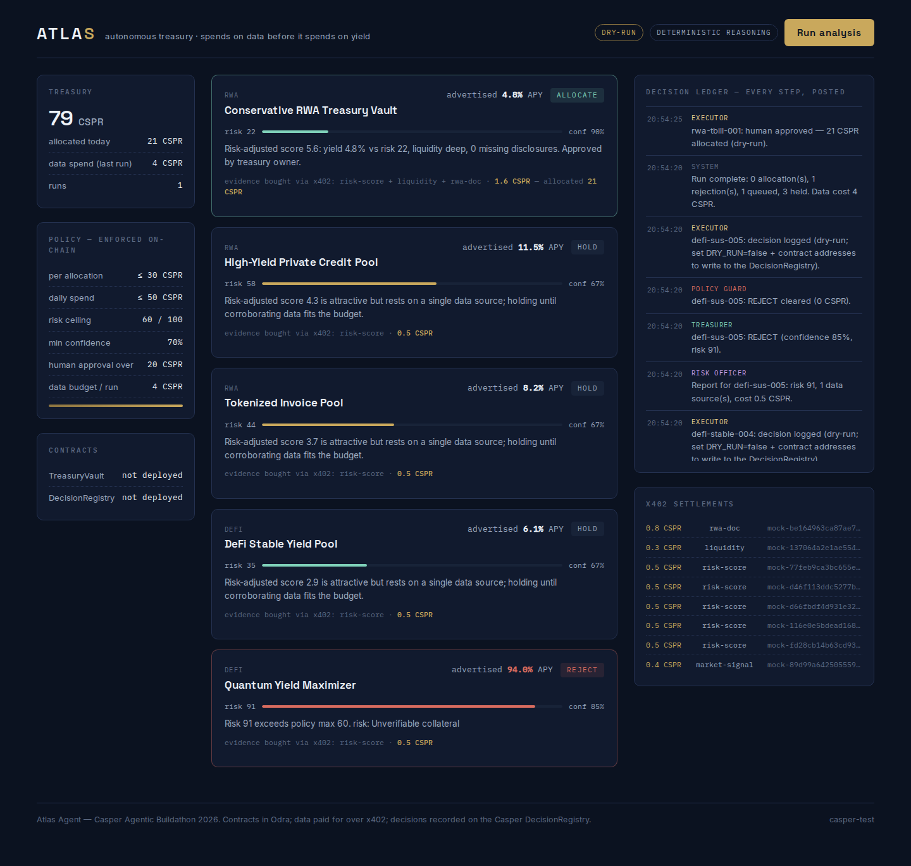

# Atlas Agent

**An autonomous treasury agent for Casper that spends money intelligently before investing money intelligently.**

Atlas manages a small on-chain treasury. Before it moves a single CSPR into a yield opportunity, it *buys evidence* — risk scores, liquidity terms, RWA document analyses — from paid data services over the **x402 payment protocol**, within a hard data budget. Every decision (allocate, reject, hold, or escalate to a human) is recorded on a **DecisionRegistry contract on Casper Testnet**, and allocations are executed through a **TreasuryVault contract that enforces the treasury policy on-chain**, independently of anything the agent believes.

Built for the **Casper Agentic Buildathon 2026**.

> 🟢 **Live on Casper Testnet.** See [docs/TESTNET-WALKTHROUGH.md](docs/TESTNET-WALKTHROUGH.md) for a
> screenshot walkthrough with the deployed contract addresses and on-chain proof.
> Vault [`hash-468ef5…`](https://testnet.cspr.live/contract-package/468ef5d146cea36fa9ea25bf37806edf9bb41b420f336991edca78ce249d9c51) ·
> Registry [`hash-14509e…`](https://testnet.cspr.live/contract-package/14509e44884fb13cc385737081c6539b41532ad2971a75c740c7571a1fd40cf8) ·
> Treasurer: Gemma 4 via OpenRouter.



The one-sentence pitch: most "DeFi agents" decide on free, unverified data and hold the keys themselves. Atlas pays for its information, proves what it paid and why, and physically cannot exceed its mandate — the policy lives in the contract, not in the prompt.

## What happens in a run

```
Scout ──► Analyst ──► Risk Officer ──► Treasurer ──► Policy Guard ──► Executor
 free      pays per     composes a      ALLOCATE /     hard rules      records on
endpoint   datum over   risk report     REJECT /       mirror the      DecisionRegistry,
           x402, under  per             HOLD           on-chain        moves CSPR via
           a budget     opportunity     (LLM or        policy          TreasuryVault
                                        scorer)
```

1. **Scout** pulls the opportunity list (the only free endpoint).
2. **Analyst** reads prices straight off x402 `402 Payment Required` responses, then buys data by *value of information*: one market signal, a risk screen for every opportunity it can afford, and a deep dive (liquidity + RWA docs) on the best risk-adjusted candidate — never exceeding the per-run data budget.
3. **Risk Officer** composes a report per opportunity from the purchased payloads.
4. **Treasurer** decides. With `ANTHROPIC_API_KEY` set it reasons with Claude (strict JSON, schema-validated); otherwise a transparent deterministic scorer runs. Either way it **never allocates on a single data source**.
5. **Policy Guard** is a pure hard-rule layer: risk ceiling, confidence floor, per-op and daily caps, approval threshold. The LLM proposes; the guard disposes.
6. **Executor** records *every* decision on the DecisionRegistry and calls `execute_allocation` on the TreasuryVault for cleared allocations. The vault re-checks the entire policy on-chain — defense in depth.

A typical run on the demo marketplace: Atlas spends 4 CSPR on evidence, allocates 21 CSPR to a conservative T-bill vault at 90% confidence, **rejects a 94% APY honeypot with paid evidence** (unverifiable collateral, anonymous team, no audit), and holds three pools it couldn't afford to corroborate. Money only moves where evidence was bought.

## Repository layout

```
contracts/   Odra 2.8 smart contracts (Rust)
  src/treasury_vault.rs      vault + on-chain policy enforcement (+ unit tests)
  src/decision_registry.rs   append-only decision audit trail (+ unit tests)
  src/bin/livenet.rs         CLI for Casper Testnet deploy & calls (Odra livenet backend)
services/    x402-paid data services (Express/TS)
  src/x402.ts                402 middleware: PaymentRequirements → PAYMENT-SIGNATURE → settlement
  src/data.ts                5 simulated opportunities + deterministic paid datasets
agent/       the agent itself (TS)
  src/orchestrator.ts        the six-step pipeline above
  src/x402Client.ts          pays for data: 402 → sign authorization → retry → receipt
  src/reasoning.ts           Claude or deterministic Treasurer
  src/policyGuard.ts         hard-rule layer (mirrors the contract)
  src/chain.ts               all Casper writes, via the atlas_livenet binary
  src/index.ts               CLI + HTTP API for the dashboard
  src/mcp.ts                 Atlas MCP server — drive the agent from any MCP host
web/         Next.js dashboard (treasury rail · opportunity desk · decision ledger)
docs/        demo script, architecture diagram
```

## Quickstart (no chain, no keys, ~2 minutes)

Requires Node 20+.

```bash
npm install
npm run services        # terminal 1 — data services on :4021 (x402 mock settlement)
npm run agent           # terminal 2 — agent API on :4030 (DRY_RUN=true)
cd web && npm install && npm run dev   # terminal 3 — dashboard on :3000
```

Open http://localhost:3000 and press **Run analysis**. Or skip the UI:

```bash
npm run agent:run       # one-shot pipeline, ledger printed to the console
```

To let Claude be the Treasurer: `ANTHROPIC_API_KEY=sk-... npm run agent`.

### Drive Atlas from an MCP host

Atlas ships an MCP server with five tools (`atlas_state`, `atlas_opportunities`, `atlas_run_analysis`, `atlas_decisions`, `atlas_approve`). With the agent API running, add to e.g. Claude Desktop:

```json
{ "mcpServers": { "atlas": {
    "command": "npx",
    "args": ["tsx", "<repo>/agent/src/mcp.ts"],
    "env": { "AGENT_URL": "http://localhost:4030" } } } }
```

Then ask: *"Run a treasury analysis and tell me what Atlas decided and why."*

## Tests & CI

```bash
npm run typecheck          # services + agent
npm test                   # agent + services unit tests (policy guard, scorer, x402 crypto, …)
npm run test:e2e           # spawns services+agent (mock/dry-run): auth → pipeline → x402 → persistence
npm run test:resilience    # agent degrades gracefully when a dependency is down
cd contracts && cargo test # 12 Odra-VM contract unit tests
```

`.github/workflows/ci.yml` runs all of the above plus the web build and the per-module wasm build on every push/PR.

## Observability

- `GET /api/health` — liveness (always `200` if the process answers) plus `uptimeSec`, `lastError`, and `deps.services` reachability, so a monitor can tell "agent down" from "dependency down".
- `GET /api/metrics` — `runs`, `decisions`, `pendingApprovals`, `treasuryBalanceCspr`, `spentTodayCspr`, `reasoner`, `lastError`.
- `npm run monitor` (the `atlas-monitor` pm2 app) polls agent + services + web + facilitator + the testnet RPC every 30s and logs `ALERT`/`RECOVERED`; set `MONITOR_WEBHOOK_URL` to also POST alerts.

## Going live on Casper Testnet

Prereqs: Rust nightly with the `wasm32-unknown-unknown` target (already pinned in
`contracts/rust-toolchain.toml`), `wasm-strip` (wabt) + `wasm-opt` (binaryen), and a funded testnet
key from the [faucet](https://testnet.cspr.live/tools/faucet).

```bash
cd contracts
cargo test                                       # unit tests (Odra VM)
./build-wasm.sh                                  # per-module wasm -> wasm/{TreasuryVault,DecisionRegistry}.wasm
cargo build --release --features livenet --bin atlas_livenet

export ODRA_CASPER_LIVENET_NODE_ADDRESS=https://node.testnet.casper.network/rpc
export ODRA_CASPER_LIVENET_EVENTS_URL=https://node.testnet.casper.network/events
export ODRA_CASPER_LIVENET_CHAIN_NAME=casper-test
export ODRA_CASPER_LIVENET_SECRET_KEY_PATH=/path/to/owner_secret_key.pem

./target/release/atlas_livenet deploy            # -> {"vault":"hash-…","registry":"hash-…"}
./target/release/atlas_livenet fund-vault <vault> 100000000000
./target/release/atlas_livenet set-agent  <vault> <agent-account>        # two-key: a separate agent
./target/release/atlas_livenet set-recorder <registry> <agent-account> true
./target/release/atlas_livenet set-recipient <vault> <recipient> true    # owner-approved payee
```

> **Build note:** `cargo-odra` 0.1.6 (the only published version) predates Odra 2.8's build flow and
> emits byte-identical wasm for every contract — use `./build-wasm.sh` (per-module `ODRA_MODULE`
> builds + sign-extension lowering), **not** `cargo odra build`. `ODRA_CASPER_LIVENET_EVENTS_URL` is
> required by the livenet backend (it was missing from older docs).

Set `.env` (`DRY_RUN=false`, both contract addresses, the agent + owner key paths,
`AGENT_API_TOKEN`), then run the whole stack supervised under pm2:

```bash
npm run stack            # services :4021 + agent :4030 + dashboard :3000 (+ facilitator if vendored)
npm run stack:status     # · npm run stack:logs · npm run stack:stop
```

Every decision lands on the DecisionRegistry and approved allocations move testnet CSPR through the
vault — visible on [testnet.cspr.live](https://testnet.cspr.live).

**Security model** (enforced on-chain, with unit tests): owner/agent **key separation**, owner-managed
**recipient allowlist**, **cumulative** per-opportunity cap, daily cap, and a human-approval threshold.
The agent API's state-changing endpoints (`/api/run`, `/api/approve`) require a bearer `AGENT_API_TOKEN`.

### x402 settlement modes

| Mode | How | What settles |
|---|---|---|
| **mock** (default) | leave `FACILITATOR_URL` unset | services verify the client's ed25519 authorization in-process; receipt labelled `mode:"mock"`. Fast, offline. |
| **facilitator** (real, proven on testnet) | `bash scripts/setup-facilitator.sh` (clones + builds the pinned [make-software/casper-x402](https://github.com/make-software/casper-x402) into `vendor/`, writes its `.env`), then set `FACILITATOR_URL` + the CEP-18 token vars (`X402_ASSET_PACKAGE`, `X402_PAYEE`, `X402_TOKEN_*`) + `X402_PAYER_KEY_PATH` in `.env`; `npm run stack` supervises it on :4022 | the agent signs an **EIP-712 `TransferWithAuthorization`** (casper-js-sdk + casper-eip-712); the facilitator submits a CEP-18 `transfer_with_authorization` on Casper — the receipt carries the **real deploy hash** |

Both modes speak the real protocol shape — `402` + `PaymentRequirements` → signed authorization in a
`PAYMENT-SIGNATURE` header → `X-PAYMENT-RESPONSE` receipt — so switching is configuration, not code.
Real mode makes every data buy an on-chain settlement (~slow); unset `FACILITATOR_URL` for a snappy
mock demo.

## Configuration

Copy `.env.example` and adjust. Highlights:

| Variable | Default | Meaning |
|---|---|---|
| `DRY_RUN` | `true` | log chain writes instead of submitting them |
| `VAULT_ADDRESS` / `REGISTRY_ADDRESS` | — | deployed contract hashes (required when live) |
| `ANTHROPIC_API_KEY` | — | enables Claude as the Treasurer |
| `POLICY_MAX_PER_OP` / `POLICY_MAX_DAILY` | 30 / 50 | CSPR caps (mirrored on-chain) |
| `POLICY_MAX_RISK` / `POLICY_MIN_CONFIDENCE` | 60 / 0.7 | decision gates |
| `POLICY_APPROVAL_THRESHOLD` | 25 | CSPR above which a human must approve |
| `POLICY_DATA_BUDGET` | 4 | CSPR the Analyst may spend on data per run |
| `FACILITATOR_URL` | — | switch services to on-chain x402 settlement |

## How this maps to the judging criteria

- **Working smart contracts / technical execution** — two Odra contracts with unit tests; policy enforced *in* the vault (no cross-contract trust); a livenet CLI the agent shells out to, so deploys and calls share one audited binding.
- **Use of AI / agentic systems** — a six-role agent pipeline; LLM reasoning with schema-validated output and a deterministic fallback; an MCP server so any model can operate the treasury; a hard policy layer between the model and money.
- **Innovation** — cost-aware *value-of-information* data buying: the agent's first economic decision is what knowledge is worth paying for. x402 isn't a bolt-on; it's the agent's epistemology.
- **Real-world applicability** — DAO and protocol treasuries need exactly this: auditable, policy-bounded, evidence-backed allocation with human escalation above a threshold.
- **UX** — a live dashboard where every agent step posts to a ledger; approvals are one click; rejected scams show the evidence that killed them.

## Originality

All code in this repository was written from scratch for the Casper Agentic Buildathon 2026. Dependencies are standard open-source libraries (Odra, Express, Next.js, the MCP SDK); the x402 integration follows the protocol shape of the official Casper facilitator.

## Roadmap

- Swap the demo marketplace for live Casper DeFi/RWA sources; let third parties list x402 data services Atlas can discover and price.
- casper-eip-712 signer so the agent's data payments settle on-chain by default.
- Multi-treasury: one Atlas serving several vaults with distinct mandates.
- Strategy outcomes fed back into the registry, so the agent's track record is itself on-chain and queryable.

## License

MIT — see [LICENSE](LICENSE).
