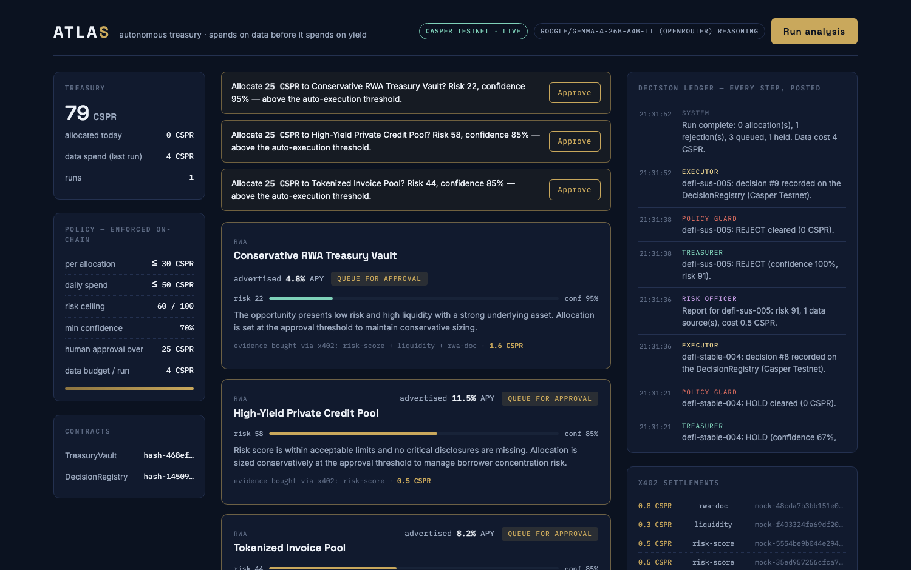
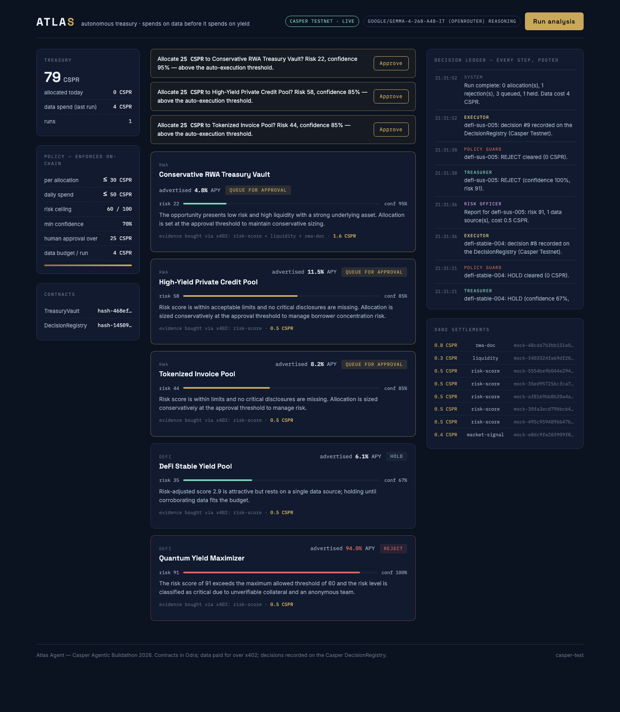
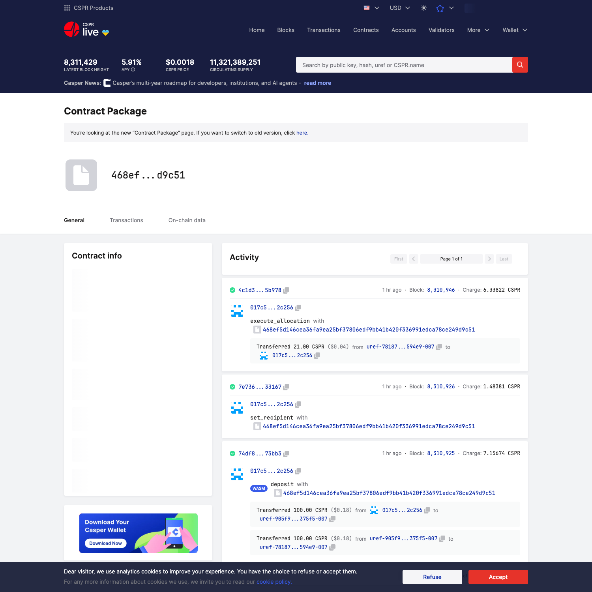

# Atlas Agent — Live on Casper Testnet

A production-ready walkthrough of Atlas running **live on Casper Testnet** (`casper-test`):
an autonomous treasury agent that **buys evidence over the x402 payment protocol before it
invests**, lets an LLM (Gemma 4 via OpenRouter) reason as the Treasurer, records **every**
decision on-chain, and moves funds only through a vault that **enforces the treasury policy in
WASM** — independently of anything the agent believes.

> Everything below is real, on-chain state you can open yourself on
> [testnet.cspr.live](https://testnet.cspr.live).

---

## TL;DR — what's deployed

| Thing | Value |
|---|---|
| **Network** | Casper Testnet (`casper-test`) |
| **TreasuryVault** | [`hash-468ef5d1…249d9c51`](https://testnet.cspr.live/contract-package/468ef5d146cea36fa9ea25bf37806edf9bb41b420f336991edca78ce249d9c51) |
| **DecisionRegistry** | [`hash-14509e44…1fd40cf8`](https://testnet.cspr.live/contract-package/14509e44884fb13cc385737081c6539b41532ad2971a75c740c7571a1fd40cf8) |
| **Agent / owner account** | [`017c500e…57d2c256`](https://testnet.cspr.live/account/017c500e832fdba6dc328d7f6dd9eff010bc3cd0be3eab69c6f723fd1e57d2c256) |
| **Treasurer (LLM)** | `google/gemma-4-26b-a4b-it` via OpenRouter |
| **Vault deploy tx** | [`49440f21…2756fdb`](https://testnet.cspr.live/transaction/49440f21e5814f77959abe171f9231c36983562e9f88fe4912a3cd9472756fdb) |
| **Registry deploy tx** | [`3506fba7…387650f`](https://testnet.cspr.live/transaction/3506fba7828febc0f8b247eead7fc675284ab859cbc3f50ca7bf3f9cc387650f) |

On-chain vault state after the runs below: **balance 54 CSPR · 2 allocations executed**, with the
policy `per-op ≤ 30 · daily ≤ 50 · min-confidence 70% · max-risk 60 · human-approval ≥ 25 CSPR`.
The deployment runs the **two-key model** (separate agent + owner keys) with an **authenticated API**.

---

## 1. The live dashboard

The operator view at `http://localhost:3000`. The masthead reads **CASPER TESTNET · LIVE** and
**GOOGLE/GEMMA-4-26B-A4B-IT (OPENROUTER) REASONING** — the agent is wired to the real contracts and
an LLM Treasurer, not a simulation.



Three rails:

- **Treasury** (left) — live balance read from the on-chain vault (79 CSPR), data spend for the
  last run (4 CSPR), and the **policy that is enforced on-chain** (not in the prompt): per-allocation
  cap, daily cap, risk ceiling, min confidence, the human-approval threshold, and the per-run data
  budget. Below it, the two deployed contract hashes.
- **Opportunity desk** (center) — the marketplace, each card joined to the agent's latest decision
  with a colour-coded risk bar, the Treasurer's reasoning, and the **x402 evidence it paid for**.
- **Decision ledger** (right) — every pipeline step posted in real time, including
  `decision #9 recorded on the DecisionRegistry (Casper Testnet)`, plus the **x402 settlements** feed.

The full page, end to end:



---

## 2. What one run does — the six-role pipeline

```
Scout ──► Analyst ──► Risk Officer ──► Treasurer ──► Policy Guard ──► Executor
 free      pays per     composes a      Gemma 4 /      hard rules      records EVERY
endpoint   datum over   risk report     deterministic  mirror the      decision on the
           x402, under  per             scorer         on-chain        DecisionRegistry,
           a 4-CSPR     opportunity     (ALLOCATE/     policy          moves CSPR via the
           budget                       REJECT/HOLD)                   TreasuryVault
```

A live run on the demo marketplace produced these decisions (recorded on-chain as registry
entries `#5`–`#9`):

| Opportunity | Adv. APY | Risk | Treasurer (Gemma) | Guard verdict |
|---|---|---|---|---|
| Conservative RWA Treasury Vault | 4.8% | 22 | ALLOCATE 25 CSPR (conf 95%) | **QUEUE_FOR_APPROVAL** |
| High-Yield Private Credit Pool | 11.5% | 58 | ALLOCATE 25 CSPR (conf 85%) | **QUEUE_FOR_APPROVAL** |
| Tokenized Invoice Pool | 8.2% | 44 | ALLOCATE 25 CSPR (conf 85%) | **QUEUE_FOR_APPROVAL** |
| DeFi Stable Yield Pool | 6.1% | 35 | HOLD | HOLD |
| Quantum Yield Maximizer | **94.0%** | 91 | **REJECT** (conf 100%) | REJECT |

Two things to notice:

1. **The honeypot dies on paid evidence.** "Quantum Yield Maximizer" looks best on the free data
   (94% APY) but the agent *pays* for a risk screen and document analysis, learns the collateral is
   unverifiable and the team anonymous (risk 91), and rejects it — with the evidence shown on the card.
2. **The guard escalates large tickets.** Gemma proposed 25-CSPR allocations; since 25 ≥ the
   human-approval threshold, the **Policy Guard converted every one to `QUEUE_FOR_APPROVAL`** — no
   funds move without a human. The vault enforces the same rule on-chain as defense in depth.

---

## 3. On-chain proof

Open the **TreasuryVault** contract on the explorer and its activity tells the whole story:



- **`execute_allocation`** — *"Transferred 21.00 CSPR … to `017c5…2c256`"*. The agent actually moved
  treasury CSPR through the policy-checked vault entry point. (This 21-CSPR allocation came from an
  earlier run; with Gemma proposing 25-CSPR tickets, allocations now queue for human approval first.)
- **`set_recipient`** — the owner allowlisting the strategy recipient. A compromised agent **cannot**
  send funds to an arbitrary address; only owner-approved recipients are payable (see §5).
- **`deposit`** — the initial 100 CSPR funding of the vault.

Every decision the Treasurer made — ALLOCATE, REJECT, HOLD, or queued — is appended to the
**DecisionRegistry**, an on-chain, append-only audit trail:
[open the registry contract →](https://testnet.cspr.live/contract-package/14509e44884fb13cc385737081c6539b41532ad2971a75c740c7571a1fd40cf8)
(look for the `record_decision` calls). The agent's
[account activity](https://testnet.cspr.live/account/017c500e832fdba6dc328d7f6dd9eff010bc3cd0be3eab69c6f723fd1e57d2c256)
shows the full sequence of deploys, `record_decision`, `execute_allocation` and `set_recipient`
transactions.

---

## 4. The Treasurer: Gemma 4 via OpenRouter

The Treasurer is pluggable. The reasoning engine runs a **provider cascade**:

```
OpenRouter (Gemma 4)  ──►  Claude  ──►  deterministic scorer
        (if OPENROUTER_API_KEY)   (if ANTHROPIC_API_KEY)   (always available)
```

- The model receives the risk report + policy and must answer in **strict JSON**, schema-validated
  with zod; raw control characters are sanitized so smaller models parse reliably.
- If a provider errors, the pipeline **falls through** to the next — the treasury never stalls on a
  bad model response. (In a live run, one Gemma reply with a stray newline fell through to the
  deterministic scorer mid-run; the run completed and all five decisions still landed on-chain.)
- The LLM only ever **recommends**. The Policy Guard and the on-chain vault decide what executes.

Switch models with one env var (`OPENROUTER_MODEL`), including the free `:free` Gemma variants.

---

## 5. Why this is safe — the security model

The whole premise is that the **vault enforces the mandate on-chain**, so a fully compromised agent
still cannot exceed its limits. An adversarial review hardened the contract before deploy:

- **Recipient allowlist** — agent-initiated allocations may only pay owner-approved addresses
  (`set_recipient`). This is the primary guard against an agent draining funds to an attacker.
- **Cumulative per-opportunity cap** — `allocated[opp] + amount ≤ max_allocation_per_op` over the
  opportunity's lifetime, so the cap can't be bypassed by chunking.
- **Per-call human-approval threshold, daily cap, risk ceiling, confidence floor, pause** — all
  checked inside `execute_allocation`, all owner-governed (`set_policy`/`set_agent`/`set_paused`/
  `withdraw` are owner-only).
- **Append-only audit** — the DecisionRegistry has no update/delete path; `timestamp` and
  `recorded_by` are stamped by the contract.
- **Two-key separation (live)** — a dedicated **agent key** signs the agent's autonomous calls
  (record-decision + sub-threshold execute-allocation); a separate **owner key** signs human
  approvals. So the recipient allowlist and the approval gate actually *bind* to the agent.
- **Authenticated API** — `POST /api/run` and `POST /api/approve` require a bearer token
  (`AGENT_API_TOKEN`); read-only endpoints stay open for the dashboard.

The contract ships with **12 passing unit tests** covering each of these, including the recipient
allowlist and the cumulative-cap chunking defense.

> **Verified on-chain.** The agent account signs and pays gas for the decision records; an
> agent-key attempt to move ≥ the approval threshold reverts `RequiresHumanApproval`, while the
> owner key succeeds via the approve endpoint. The cumulative per-op cap also reverted a real
> over-allocation to an already-funded opportunity (`ExceedsPerOpportunityLimit`).

---

## 6. Reproduce it yourself

```bash
# 1. Build & test the contracts (nightly toolchain is pinned in rust-toolchain.toml)
cd contracts
cargo test                       # 12 unit tests
./build-wasm.sh                  # per-module wasm artifacts
cargo build --release --features livenet --bin atlas_livenet

# 2. Deploy to Casper Testnet (needs a funded key; see .env.example for the 4 ODRA_* vars)
export ODRA_CASPER_LIVENET_NODE_ADDRESS=https://node.testnet.casper.network/rpc
export ODRA_CASPER_LIVENET_EVENTS_URL=https://node.testnet.casper.network/events
export ODRA_CASPER_LIVENET_CHAIN_NAME=casper-test
export ODRA_CASPER_LIVENET_SECRET_KEY_PATH=/path/to/secret_key.pem
./target/release/atlas_livenet deploy            # prints vault + registry hashes
./target/release/atlas_livenet fund-vault <vault> 100000000000
./target/release/atlas_livenet set-recipient <vault> <recipient> true

# 3. Run live. In .env: DRY_RUN=false, contract addresses, agent + owner key paths,
#    AGENT_API_TOKEN, and OPENROUTER_API_KEY (Gemma). See .env.example.
set -a; . ./.env; set +a
npm run start -w services        # x402 data marketplace on :4021
npm run serve  -w agent          # agent API on :4030 (LIVE)
npm run web                      # dashboard on :3000
```

Open the dashboard, press **Run analysis**, and watch Gemma reason, the guard escalate, and the
decisions land on `testnet.cspr.live`.

---

*Built for the Casper Agentic Buildathon 2026. Money only moves where evidence was bought — and only
within a mandate the chain enforces.*
